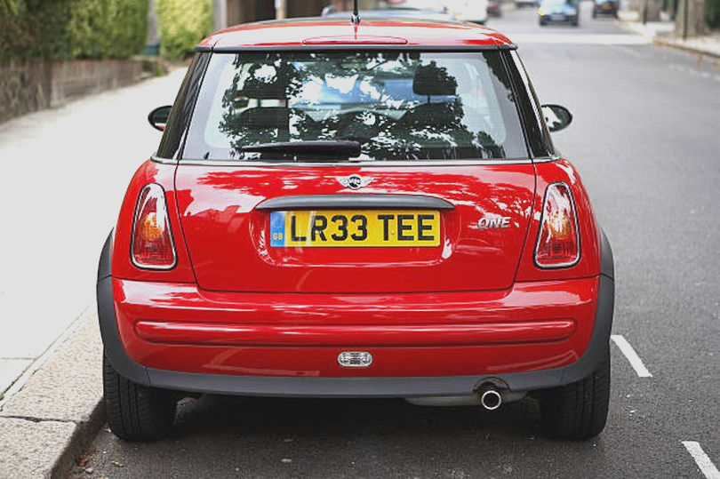
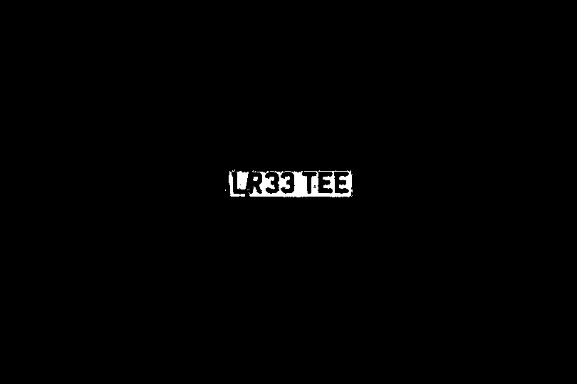
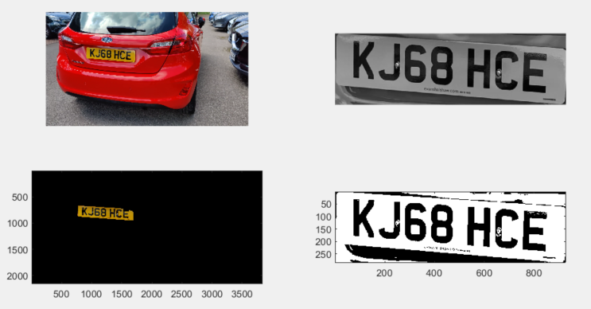

# The Project Idea  

This repository showcases a series of applied image processing exercises and a final proof-of-concept system, developed and refined while working extensively in **MATLAB** during my time at **MathWorks**.  

The work covers multiple core areas of image processing, each implemented with an emphasis on concise, efficient code and industry-standard best practices. 
Key topics include:  
- Image Representation  
- Image Statistics  
- Histograms and Thresholding  
- Contrast Manipulation  
- Morphological Operators  
- Rotation and Scaling  
- Nonlinear Spatial Filtering  
- Linear Spatial Domain Filters  
- Edge Detection and Correlation  
- Steganography  
- Spatial Frequency  

All solutions were built with a “less is more” philosophy. Each exercise folder contains a detailed `presentation.pdf` outlining the objectives, methodology, and results for that stage of the work.  

---

## Final Project – Automatic Number Plate Recognition (ANPR)  

The final stage of this work involved designing and refining an **Automatic Number Plate Recognition** system in MATLAB, closely aligned with the type of R&D work undertaken during my placement.  

**Key Features and Achievements:**  
- Applied **spatial filtering**, **morphological operations**, and **thresholding** to optimise character recognition accuracy.  
- Built a **diverse training dataset** by capturing number plates in varied lighting, times of day, and vehicle colours to improve algorithm generalisation.  
- Addressed edge-case misclassifications (e.g., “1” vs “I”, “O” vs “0”, “6” vs “G”) and colour-based challenges such as yellow vehicles blending with rear UK plates.  
- Implemented a video processing pipeline capable of analysing each frame, applying recognition filters, and extracting target plates.  
- Documented potential enhancements, including hardware-level improvements using specialist ANPR-grade optics and IR/laser-based capture for low-light conditions.  

While the system demonstrated high accuracy in most scenarios, further testing under varied environmental conditions is recommended for full deployment readiness. However, it is important to note that all development and testing were conducted using consumer-grade hardware, primarily a standard webcam and a mobile phone camera. These devices have inherent limitations in resolution, pixel density, and low-light performance, which directly affect the accuracy of number plate recognition.

In modern law enforcement and traffic monitoring applications, dedicated ANPR cameras are used, often equipped with infrared (IR) illumination and high-speed shutters. These technologies allow for consistent, high-contrast imaging of plates regardless of vehicle speed, lighting conditions, or weather. While upgrading to such hardware would undoubtedly enhance the reliability and real-world applicability of this system, particularly for nighttime operation, bad weather conditions and or when plate illumination is absent, absolute accuracy was never the primary objective of this project. In an industrial deployment, the best available equipment would be used. In my case, the aim was to demonstrate my ability to design and implement a functional solution in **MATLAB** using only the resources available to me, and in that regard, the system performed exactly as intended.

---

## Tech Stack  

- [MATLAB](https://en.wikipedia.org/wiki/MATLAB) – multi-paradigm programming language and numeric computing environment developed by [MathWorks](https://en.wikipedia.org/wiki/MathWorks)  
- [Image Processing Toolbox](https://uk.mathworks.com/products/image.html)  
- [Computer Vision Toolbox](https://uk.mathworks.com/products/computer-vision.html)  

---

## Demo  

  

---  

  

---  

  

---  

  

---  

  

---

## User Guide – Running the Application  

**Step 1:**  
[Download MATLAB](https://uk.mathworks.com/campaigns/products/trials.html)  

**Step 2:**  
Install [Image Processing Toolbox](https://uk.mathworks.com/products/image.html) and [Computer Vision Toolbox](https://uk.mathworks.com/products/computer-vision.html)  

**Step 3:**  
Access the desired application directory  

**Step 4:**  
Run the MATLAB code file and click compile  

---

Thank you for having a look!  
